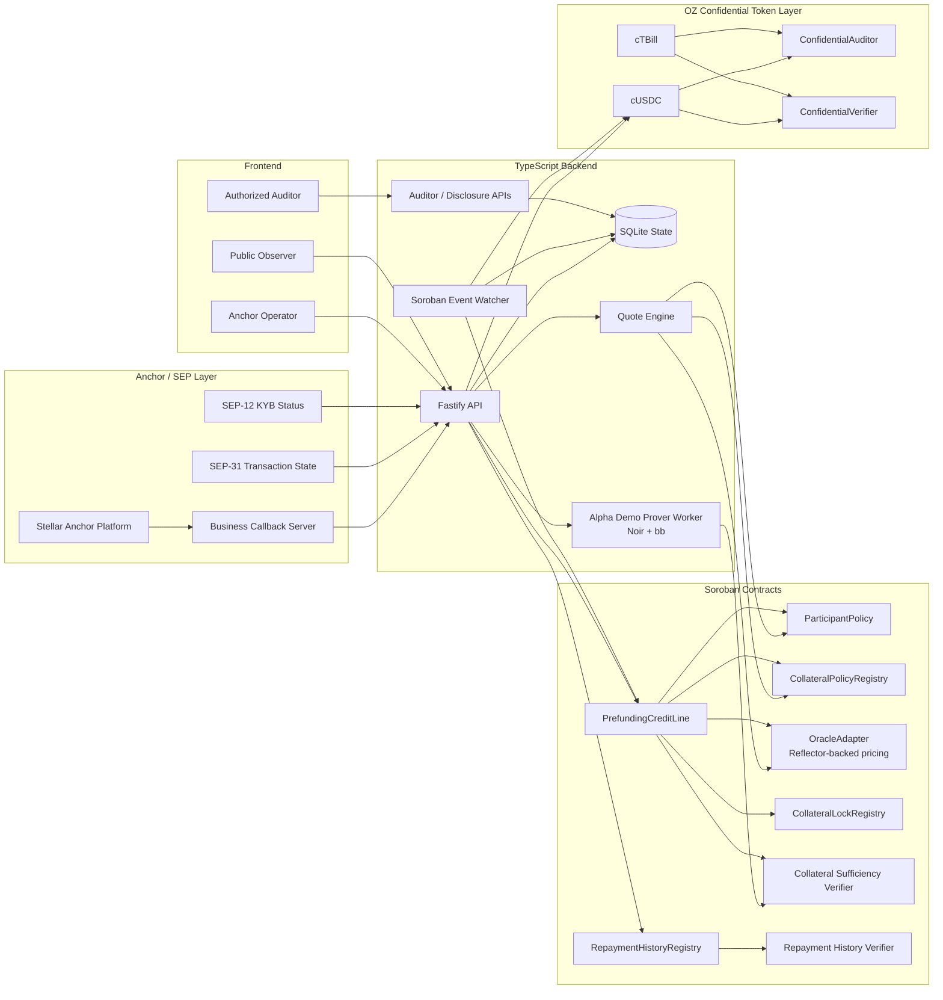

# Nyx Confidential Prefunding

[](https://www.youtube.com/watch?v=-wNmBygVal8&t=1s)

## What Is Nyx

Nyx is a private prefunding credit layer for Stellar anchors.

It lets an anchor unlock short-term stablecoin liquidity against tokenized collateral, without publicly revealing reserve size, draw amount, repayment amount, or credit capacity.

Nyx is contract-first. The core trust layer lives in Soroban contracts and Noir circuits: participant policy, collateral policy, oracle checks, collateral locks, credit lifecycle, confidential token transfers, and proof verification.

The TypeScript backend is not the source of financial truth. It provides compliance and orchestration infrastructure around the contracts: SEP-12/KYB callbacks, SEP-31 transaction state, quote coordination, proof-job orchestration, watcher indexing, snapshot caching, and auditor/disclosure APIs.

This means the backend is configurable per anchor/operator, while the core credit and privacy guarantees stay enforced by contracts and verifier circuits.

The dashboard and hosted backend in this repo are the demo and integration surface. The product is the embedded credit API plus contract/circuit protocol that can be configured for different anchors, because every anchor has different compliance, KYB, payout, treasury, and reporting requirements.

## The Problem

Stellar is strong for cross-border payments because of anchors. But even when the blockchain leg is fast, anchors still face slow bank settlement, local payout timing, and liquidity gaps.

To make payouts feel instant, an anchor often has to prefund wallets, payout partners, or settlement accounts before final settlement arrives. That locks capital in advance just to cover timing risk.

This is not a theoretical problem. Arf validated the market with real numbers: [Circle's Arf case study](https://www.circle.com/case-studies/arf) reports **$1.4B+ cumulative USDC-based liquidity volume in Arf's first year** and **50x annual capital turnover**. [Stellar's Arf case study](https://stellar.org/case-studies/arf) reports **$830M+ in USDC loans over 20 months**, powered by a **$16M facility**, with **$1.6B+ total on-chain USDC volume** and no defaults or late repayments reported in that case study.

But the current model is still paperwork-heavy and trust-based. To get credit, an anchor may need to expose reserves, collateral, liquidity needs, and counterparty flow to a lender or auditor. For an institutional payment company, that leaks competitive information and can reveal treasury stress.

The usual choices are bad:

- Keep idle USDC in corridors, which is capital-inefficient.
- Borrow externally and expose treasury stress or reserve size.
- Move collateral publicly and leak strategy to competitors.
- Ask lenders and auditors to trust off-chain PDFs, screenshots, or delayed reconciliation.

For institutional anchors, the hard requirement is not just "can we borrow against collateral?" It is:

- Prove collateral sufficiency without disclosing the collateral amount.
- Release settlement liquidity privately.
- Keep a public audit trail that proves state transitions happened.
- Let an authorized auditor decrypt exact amounts.
- Let a counterparty verify selected facts without seeing the whole book.
- Keep SEP-31 payout state separate from product credit state.

## The Solution

Nyx combines Stellar Anchor Platform, Soroban contracts, OpenZeppelin Confidential Tokens, Noir proofs, and a TypeScript coordination backend.

The flow:

1. Anchor Platform creates or ingests a SEP-31 payout transaction.
2. Alpha KYB status is synced to `ParticipantPolicy` on-chain.
3. The backend quotes private prefunding from real policy/oracle contract state.
4. Alpha's proving environment generates a collateral sufficiency proof.
5. `PrefundingCreditLine.open` verifies the Noir proof on Soroban.
6. Facility releases cUSDC through an OZ confidential token transfer.
7. Public state shows an active/repaid position, but not amounts.
8. Auditor decrypts live confidential transfer ciphertext references.
9. Repayment closes the credit line and releases the collateral lock.
10. Repayment history proof verifies a scoped private-history statement.
11. Disclosure links expose only approved scoped data with expiry/revocation metadata.

## Business Model

Nyx is built for regulated anchors, remittance operators, payment processors, and institutional treasury teams that need short-duration settlement liquidity without publicly exposing balance-sheet details.

### Customer

The primary customer is an anchor or payment operator with real payout obligations and high-quality tokenized collateral. Secondary users include facility providers, auditors, accountants, and institutional counterparties that need proof-backed visibility into risk without receiving full treasury data.

### Product

Nyx is offered as embedded private prefunding infrastructure:

- Anchors request short-term credit against confidential collateral.
- Facility providers supply liquidity into the credit flow.
- Auditors get authorized decryptable evidence and scoped disclosure workflows.
- Counterparties receive proof-backed facts instead of raw books.
- Operators integrate Nyx through configurable APIs instead of rebuilding contract, proof, compliance, and watcher infrastructure for every corridor.

### Supply Side: Blend Integration

Nyx separates the borrower privacy layer from the liquidity supply layer.

The anchor's private collateral protects the Nyx credit line, while Blend can provide wholesale USDC liquidity to the facility side. This means Nyx does not need to be the lender itself; it can route credit demand into an existing on-chain liquidity market.

In the Blend-backed model:

1. A facility account supplies public collateral into Blend.
2. Blend lends USDC to that facility account against visible pool collateral.
3. Nyx wraps or routes that liquidity into confidential cUSDC.
4. The anchor receives private short-term prefunding after its ZK collateral proof verifies.
5. When the anchor repays, the facility can repay or rebalance its Blend position.

This creates two clean risk layers:

| Layer | Collateral | Visibility | Purpose |
|:--|:--|:--|:--|
| Blend facility layer | Public Blend collateral | Public | Sources wholesale USDC liquidity. |
| Nyx anchor layer | Confidential tokenized RWA collateral | Private with ZK proof | Underwrites the anchor without exposing reserves. |

The mainnet `BlendFacility` adapter is deployed and points at Blend's live pool and USDC asset. This shows Nyx can plug into Stellar-native liquidity instead of relying only on a static demo treasury.

### Revenue

Nyx monetizes the embedded infrastructure layer. The clean revenue line is an API/protocol fee charged to anchors or operators when they use Nyx to quote, prove, open, draw, repay, and audit private prefunding credit.

| Revenue line | Basis | Why it fits |
|:--|:--|:--|
| Embedded API fee | Per successful prefunding workflow, or basis points on opened credit volume | Directly tied to the infrastructure Nyx provides: SEP/KYB orchestration, quotes, proof jobs, contract execution, watcher state, and auditor/disclosure APIs. |

### Why Customers Pay

Nyx reduces idle prefunding capital, speeds payout execution, and lets institutions prove solvency or repayment quality without leaking strategic reserves. For an anchor, the economic win is simple: less dormant USDC, faster settlement, and stronger auditability. For Nyx, the business is selling embedded compliance and credit infrastructure, not becoming every anchor's custom backend team.

### Go-To-Market

The first wedge is remittance and B2B payout anchors with predictable short settlement windows. From there, the infrastructure expands into private RWA-backed credit lines, liquidity facility integrations, and compliance-grade disclosure APIs for institutions that need selective transparency.

## Architecture



## What Is In This Repo

- `backend/`: Fastify API, Anchor callbacks, quote engine, proof queue, watcher, disclosure/auditor endpoints, SQLite persistence.
- `frontend/`: Next.js demo UI for anchor operator, public observer, auditor, draw, repay, and disclosure flows.
- `oz-confidential/`: Soroban contracts, OZ confidential-token proof-of-life runner, Noir circuits, verifier artifacts, deployment helpers.
- `infra/`: Dockerfiles and Anchor Platform configuration.
- `scripts/`: demo account funding, URL printing, E2E helpers, artifact refresh utilities.
- `data/`: local SQLite state mounted into Docker.
- `deployments/` and `state/`: deployment outputs and generated demo artifacts.

## Core Components

### Anchor And Product State

Nyx keeps SEP status and product status separate.

SEP-31 status:

```txt
pending_sender -> pending_stellar -> completed
```

Nyx product status:

```txt
prefunding_required -> credit_quote_ready -> proof_pending -> proof_verified -> credit_drawn -> repaid -> closed
```

This separation matters. `pending_stellar` means the anchor payout is waiting on Stellar settlement. `credit_drawn` means the Nyx private prefunding leg has released liquidity. They are related, but they are not the same state machine.

### Contracts

- `ParticipantPolicy`: records whether Alpha or another participant is approved to use the credit system.
- `CollateralPolicyRegistry`: stores collateral eligibility, haircut, fee, and tenor policy.
- `OracleAdapter`: exposes oracle price and freshness checks, with Reflector support where configured.
- `CollateralLockRegistry`: prevents collateral reuse and releases locks after repayment.
- `PrefundingCreditLine`: opens credit, records draw, records repayment, emits stable demo events.
- `RepaymentHistoryRegistry`: stores private repayment leaf/root metadata and verifies repayment-history proof claims.

### Deployed Testnet Contracts

These are the current Stellar testnet contract IDs used by the demo configuration and checked-in deployment reports.

| Area | Contract | Testnet contract ID | Role |
|:--|:--|:--|:--|
| Credit policy | `ParticipantPolicy` | `CB22UEWEYK5AFLSBTOHVIE6Z6EPKWDAWMMI4LWKFZDRQ3MZKD67INZMM` | Stores KYB/participant approval synced from Anchor callbacks. |
| Credit policy | `CollateralPolicyRegistry` | `CAPJG5B2JK2B5TR3KYLZLQM7VMAFW6LPJCEOOY3XYDMAAS7LQVBGVBW3` | Stores eligible collateral, haircut, fee, tenor, and oracle freshness policy. |
| Credit policy | `OracleAdapter` | `CDBP2MXQ5YXPFNGOEYWFV6VLRSZKND7ICKYKPGWOHHBOAHZX4X2JS55K` | Exposes price and freshness checks; can be refreshed from Reflector where configured. |
| Credit policy | Reflector pulse | `CCYOZJCOPG34LLQQ7N24YXBM7LL62R7ONMZ3G6WZAAYPB5OYKOMJRN63` | External testnet oracle source used by the refresh path. |
| Credit state | `CollateralLockRegistry` | `CBMCCRQSVQSJE5UF55UC3PIFXWMQIDWM3CI57F3ZONEH5NR4AH7CIARG` | Prevents reuse of the same confidential collateral lock/nullifier. |
| Credit state | `PrefundingCreditLine` | `CBAC66ZAVCDSWLE22O4T72I5D4Y3DWQ7GD7ASMJCCDI63HALHDWHXFH7` | Opens credit, records draw, repayment, events, and lock release. |
| Verifier | `CollateralSufficiencyVerifier` | `CC3AV2YVDQGZBHPCILAUGEAAS5QF5QJYOV4NN2OSXVZCLIYAMKBLCDUS` | Verifies the Noir collateral sufficiency proof before credit opens. |
| Verifier | `RepaymentHistoryVerifier` | `CC45VHO7QOQXVMGIQ3NF2EITMIIIAOHXPYAP5GE2CG7NJIVJ6KLPOA3U` | Verifies the Noir repayment history proof. |
| History | `RepaymentHistoryRegistry` | `CBEMKJIIWQ4HNDDD5Z6SJMQTGUJ6PKBBKT2M7FGT3GMAFRDM2WXX6LSA` | Stores private repayment leaves/root metadata and proof nullifiers. |
| Confidential token | `cUSDC` | `CDE7R6Y7ZNNV4RDBK7BPL33KRX2JJFQ6NHS4FTTHM6P3J6MFX4LAIJRD` | OZ confidential liquidity token used for private draw/repayment artifacts. |
| Collateral asset | Active collateral token | `CD7XXR3JSLW7RQ3BL32LXHWJRXFKINAMGHKRKHE7N4F7TWEGV67CG64K` | Current configured collateral asset for the credit path. |
| OZ proof-of-life | `ConfidentialAuditor` | `CCFYKPBKHG2RH64WJSLD2LMBY5GUX3L6MFUY7NTJIM67Y7HQVPELNSTA` | Registry/source for auditor encryption keys and decryptable transfer payloads. |
| OZ proof-of-life | `ConfidentialVerifier` | `CCPPSSTYM4VKRMNC23IDJHJKDGTLIDKJTARRCXT6B7DOKFXIKHGFRZ7Q` | Registry for confidential token verifier contracts/artifacts. |
| OZ proof-of-life | `cTBill` | `CB2WSEQ4TIXEV2EQDIIAPMSBOS5YLTQ63RMMFLLSLWFJHVXXDAHQKG5H` | Confidential treasury-bill wrapper proven in the OZ token proof-of-life path. |
| OZ proof-of-life | `cXAUm` | `CART6L62LMACC4UTUHC7TTUVBJ2PQU26KQL6N4XJPIY2H7PMMQTEP6VE` | Confidential gold wrapper deployed for reference/proof-of-life, not central to prefunding. |

### Deployed Mainnet Contracts

Real Stellar mainnet contract IDs, deployed and verified live. Each address was confirmed via a direct on-chain read after deployment, not just a successful submission.

| Area | Contract | Mainnet contract ID | Role |
|:--|:--|:--|:--|
| Credit policy | `ParticipantPolicy` | `CAIZBWE4NXDT2WB4J5KULIFWGJIVNXZZGIODT7XRLTBD5JB5ZULGT4KT` | Stores KYB/participant approval. Anchor eligibility is managed on-chain through `set_participant`. |
| Credit policy | `CollateralPolicyRegistry` | `CBVWB2TV73EUWDHC36E5BMMJNXU6HZKIC4SW66XO7FDN7TRSKELJJBBH` | Eligible collateral, haircut, tenor, oracle freshness. `TBILL` configured: 5% haircut, 5-day max tenor. |
| Credit policy | `OracleAdapter` | `CCRQ2NL36F73ESAUXCHU7CHE6FRYEDPEY5MZJ33G3KZXPO2SGJMRNCM5` | Price/freshness checks. Seeded with an initial demo TBILL reference price for the RWA collateral flow. |
| Credit policy | Reflector pulse | `CAFJZQWSED6YAWZU3GWRTOCNPPCGBN32L7QV43XX5LZLFTK6JLN34DLN` | Real, live mainnet Reflector oracle. Verified directly: `base()="USD"`, tracks 16 assets including USDC/XLM/BTC/ETH. |
| Credit state | `CollateralLockRegistry` | `CCP5XSBCIBBY4RYQZ46SGOY7G2TBKDKDK4VB2A7XFXNPRXMJA2MZQN4W` | Double-pledge prevention source of truth. |
| Credit state | `PrefundingCreditLine` | `CDANS3RNG7LMLDYLBFAG5JXI4WD3PRCWQSQN45W6RA3EOBFMN6TF6PG7` | The product contract: open/draw/repay/liquidate lifecycle. |
| Verifier | `CollateralSufficiencyVerifier` | `CAAJXWNESRFOQVQXGIQ5UA44UIAFKYECXXRZ26GHG26SGCSCPH7Q6WNG` | Verifies the collateral sufficiency proof before credit opens. VK confirmed byte-identical to a fresh regeneration from current circuit source before deploying. |
| Verifier | `RepaymentHistoryVerifier` | `CDVACS3A6KQ7IJGPHGN5T6CK7YBGU4KOAJP64Y7FYZLXMWLFI6M74VUK` | Verifies the repayment history proof. Same VK-freshness check applied. |
| History | `RepaymentHistoryRegistry` | `CCYNQHQ6LJLCOENOSSHD6X2SD4DQGAR3YPUNGTP5WGH6IM6DPIEEZGJF` | Private repayment leaves/root, wired to the verifier above. |
| Confidential token | Credit currency (`cUSDC`) | `CAF7RMCG3UXC3CPDHRE5OM2G4TVSJIKQCR3MRRKS6C37EZNS4WTKKSXH` | Wraps the **real** mainnet USDC SAC (`CCW67TSZV3SSS2HXMBQ5JFGCKJNXKZM7UQUWUZPUTHXSTZLEO7SJMI75`, issuer confirmed to be Circle's official Stellar USDC issuer). |
| Collateral asset | Collateral token (`cTBill`) | `CA6ALUNCBYBCU3GZWFAZ5FXTWERCXNBLMGWOGKVF37NBDABXSJVMVVFC` | Wraps a demo `TBILL` reference asset (`CBIKLVY7TQPMGNFTRSDLSLESN6LBDYWNNE5M2XLQGVQQUOP7HMMMZIY2`) for RWA collateral flows. |
| OZ layer | `ConfidentialAuditor` | `CBSTE4PIKPMUFOQTDNIKUFRVATF65ROIINUQGOI2W5DACIITD7UUEYYG` | Auditor key registry for both confidential-token instances. |
| OZ layer | `ConfidentialVerifier` | `CAVNGRKXHVOYHHDZFPYEO4E3RKFMMJW4MS65YXWUH6NURCBUL3OJDDH2` | Verifies the OZ reference circuits (register/withdraw/transfer/spender flows). |
| Compliance | `AccountPolicy` | `CD7CFNZRDNUR6WV2CWQAY7Z6G2XBQS3HVSKM2IVMEOFFAP6K2VUTSZS3` | Compliance/blocklist hook, wired into both confidential-token instances via `set_compliance_config`. |
| Supply | `BlendFacility` | `CAYVCBWZGNO7ARF43LT4N7SWZVSSRFAVK5MMATSICAW32SZH4XAUKVZE` | Points at Blend v2's real, live mainnet default pool (`CCCCIQSDILITHMM7PBSLVDT5MISSY7R26MNZXCX4H7J5JQ5FPIYOGYFS`, `status: 0`/active), borrowing real USDC (`CCW67TSZV3SSS2HXMBQ5JFGCKJNXKZM7UQUWUZPUTHXSTZLEO7SJMI75`). |

## Stellar Integrations

Nyx is not a generic lending dashboard. It is built around Stellar's anchor, liquidity, compliance, oracle, privacy, and smart-contract stack.

### Blend Liquidity Integration

Blend is the supply-side liquidity layer for Nyx.

The mainnet `BlendFacility` adapter connects Nyx to Blend's live pool and real USDC asset. In the product model, facility operators can source wholesale USDC liquidity from Blend, then route that liquidity into Nyx's confidential credit flow for anchors.

The public repo includes the on-chain adapter and demo orchestration surface. The customer-specific Blend automation is packaged as private/operator backend infrastructure, because each facility can have different custody, risk limits, rebalance rules, and compliance controls. That backend pipeline can handle the full facility lifecycle: supply collateral to Blend, borrow USDC, wrap or route liquidity into cUSDC, release confidential draw liquidity, collect repayment, and rebalance the Blend position.

That keeps the model clean:

- Blend sees public facility collateral and public pool risk.
- Nyx sees ZK-verified private anchor collateral.
- The anchor receives confidential short-term liquidity.
- The backend pipeline can be customized per anchor/facility without changing the core contracts.

### SEP And Anchor Compliance

Nyx plugs into the Stellar anchor model instead of inventing a separate compliance workflow.

- `SEP-1`: discovery through `stellar.toml` and Anchor Platform configuration.
- `SEP-10`: authentication surface for anchor-style user/account flows.
- `SEP-12`: KYB/customer status is ingested by the backend and synced into `ParticipantPolicy`.
- `SEP-31`: payout transaction state stays separate from Nyx product state, so the payment workflow and credit workflow do not get mixed.

This matters because the backend is compliance infrastructure, not the source of financial truth. Different anchors can have different KYB vendors, sanctions policies, payout corridors, and reporting needs, while the contract layer keeps the credit rules enforceable.

### Soroban Credit Contracts

Soroban is where the credit rules live:

- `ParticipantPolicy` controls who is allowed to use the system.
- `CollateralPolicyRegistry` controls collateral eligibility, haircut, max tenor, and policy terms.
- `OracleAdapter` gives the credit contracts price/freshness inputs.
- `CollateralLockRegistry` prevents double-pledging the same confidential collateral.
- `PrefundingCreditLine` enforces open, draw, repay, lock, and lifecycle events.
- `RepaymentHistoryRegistry` verifies private repayment-history statements.

The backend coordinates these contracts, but it does not replace them.

### Reflector Oracle Integration

Reflector gives Nyx a live oracle path for market pricing.

The mainnet configuration points at Reflector's live oracle contract. Nyx uses oracle price and freshness as public proof inputs, so the collateral sufficiency proof is tied to current policy and market data instead of a frontend constant.

### OpenZeppelin Confidential Tokens

Nyx uses OpenZeppelin Confidential Tokens as the privacy layer:

- `cUSDC` represents the private liquidity leg.
- `cTBill` represents confidential tokenized collateral.
- `ConfidentialVerifier` verifies confidential token operations.
- `ConfidentialAuditor` provides encrypted auditor payloads.
- Compliance hooks restrict who can participate in the private token flow.

This lets Nyx release and repay liquidity without exposing transfer amounts publicly, while still preserving an authorized audit path.

### Noir, UltraHonk, And Stellar ZK

Nyx uses Noir circuits for the private credit statements and UltraHonk proofs for verification.

- Collateral sufficiency proves hidden collateral covers the requested credit after oracle price and haircut.
- Repayment history proves a private borrower-history property without revealing the full book.
- Pedersen commitments match the confidential-token balance model.
- Poseidon-style hashes support nullifiers, history roots, and ZK-friendly commitments.
- Soroban verifier contracts check proof outputs before credit state changes.

As Stellar adds more ZK-native primitives through protocol-level crypto support, this architecture becomes cheaper and more native to the chain.

### Confidential Token Layer

Nyx uses the OpenZeppelin Confidential Token design as the privacy source of truth:

- `cUSDC`: private liquidity leg.
- `cTBill`: private collateral representation.
- `ConfidentialAuditor`: auditor ciphertext source for decryptable transfer data.
- `ConfidentialVerifier`: verifier registry for confidential token operations.

The backend stores encrypted event references and proof artifacts. It should not become the privacy source of truth.

### ZK Proofs

Nyx currently has two proof families:

- Collateral sufficiency: proves private collateral covers requested draw after haircut.
- Repayment history: proves a private repayment-history property, such as at least a threshold number of on-time repayments, without exposing amounts or counterparties.

### Circuit Map

Product circuits are the ones the Nyx credit flow depends on. OZ confidential-token circuits are the lower-level private token operations used to prove token privacy mechanics. Helper circuits are test harnesses for shared primitives and cross-language consistency.

Full contract and circuit testing guide: [docs/contract-circuit-testing-guide.md](docs/contract-circuit-testing-guide.md)

| Circuit | Path | What it proves or computes | Used by |
|:--|:--|:--|:--|
| Collateral sufficiency | `oz-confidential/circuits/collateral_sufficiency` | The hidden collateral commitment opens to enough value to cover the hidden credit amount after oracle price and haircut; also binds tenor, lock key, and position nullifier. | `PrefundingCreditLine.open` through `CollateralSufficiencyVerifier`. |
| Repayment history | `oz-confidential/circuits/repayment_history` | A fixed private set of three repayment leaves matches a public history root and has at least the public threshold of on-time positive repayments without revealing amounts, dates, or which leaf was late. | `RepaymentHistoryRegistry.verify_history` through `RepaymentHistoryVerifier`. |
| Register | `oz-confidential/circuits/register` | The account owns a spending secret key and derives the registered spending public key and viewing public key for a specific confidential token contract. | OZ confidential account registration. |
| Transfer | `oz-confidential/circuits/transfer` | A sender owns and opens its spendable balance, subtracts the private transfer amount, creates a recipient transfer commitment, and emits recipient/sender auditor ciphertexts. | Direct confidential transfer. |
| Set spender | `oz-confidential/circuits/set_spender` | The owner escrows a private allowance for a spender, updates owner spendable balance, and emits encrypted allowance/auditor payloads. | Confidential allowance creation for delegated transfer. |
| Spender transfer | `oz-confidential/circuits/spender_transfer` | A spender owns its key, opens an existing allowance, transfers a private amount to a recipient, and updates the remaining allowance commitment. | `confidential_transfer_from` style delegated transfer. |
| Revoke spender | `oz-confidential/circuits/revoke_spender` | The owner opens an allowance commitment and folds the remaining allowance back into spendable balance while emitting owner-auditor ciphertext. | Allowance revocation/reclaim. |
| Withdraw | `oz-confidential/circuits/withdraw` | The owner opens spendable balance, subtracts a public withdrawal amount, and emits encrypted balance/auditor checkpoint data. | Confidential-to-public withdrawal flow. |
| Confidential lib | `oz-confidential/circuits/lib` | Shared Pedersen commitment, Poseidon-domain hashing, ECDH, encryption masks, viewing key derivation, and test vectors. | All OZ and Nyx circuits. |
| Primitive gadgets | `oz-confidential/circuits/gadgets/*` | Standalone test circuits for primitives such as `commit`, `ecdh`, `encrypt_amount`, `poseidon_with_domain`, `sponge_squeeze_2`, `vk_from_sk`, and curve validation. | Cross-language fixture checks and primitive regression tests. |

Demo proving runs through the `prover-worker` service as Alpha's proving environment. The same proof interface can be operated by the anchor, auditor, or another controlled execution environment while the contracts continue to verify only public proof inputs and proof bytes.

## Run Locally

The repo includes Docker services for the API, worker, frontend, Anchor Platform, and local state.

```bash
cp .env.example .env
docker compose up -d --build
```

Core checks:

```bash
curl http://localhost:3001/health
curl http://localhost:3001/api/demo/state
curl http://localhost:8080/.well-known/stellar.toml
```

Important local URLs:

```txt
Frontend:            http://localhost:3000
API:                 http://localhost:3001
Anchor Platform:     http://localhost:8080
Demo state:          http://localhost:3001/api/demo/state
Demo flow state:     http://localhost:3001/api/demo-flow/state
```

If `.env` changes, recreate the API and prover containers so Compose reloads environment values:

```bash
docker compose up -d --force-recreate --no-deps api prover-worker
```

## Testing

Contract and circuit testing is documented here:

[docs/contract-circuit-testing-guide.md](docs/contract-circuit-testing-guide.md)

Quick validation:

```bash
cd oz-confidential
cargo test --workspace

cd circuits
nargo test --workspace
nargo compile --workspace
```

Latest local validation:

```txt
cargo test --workspace: passed
nargo test --workspace: passed
nargo compile --workspace: passed
```

## API Surface

Core product APIs:

```txt
GET  /health
GET  /api/demo/state
GET  /api/demo-flow/state
POST /api/anchor/customer/status
POST /api/sep31/transactions
POST /api/prefunding/quote
POST /api/demo-flow/open
POST /api/demo-flow/draw
POST /api/demo-flow/repay
POST /api/demo-flow/history-proof
GET  /api/auditor/live-events
POST /api/auditor/decrypt
```

These APIs are orchestration infrastructure around the contract layer: SEP/KYB state, quotes, proof jobs, watcher state, and auditor evidence.

## Demo Flow Summary

The intended demo flow is intentionally simple:

1. Anchor payout need enters through SEP-31 state.
2. KYB approval syncs to `ParticipantPolicy`.
3. Quote reads policy and oracle state.
4. Collateral sufficiency proof is generated.
5. `PrefundingCreditLine` verifies the proof and opens credit.
6. cUSDC draw and repayment happen through confidential-token evidence.
7. Public view shows status only.
8. Auditor view decrypts authorized evidence.
9. Repayment history proof verifies private borrower reputation.

## Demo Evidence

The demo is designed to leave evidence at every layer without exposing private financial amounts publicly.

| Evidence layer | What to show | Why it matters |
|:--|:--|:--|
| Anchor state | SEP-31 transaction moves from liquidity need to settlement completion. | Shows the credit flow is tied to a real payout workflow. |
| Policy state | KYB approval is synced to `ParticipantPolicy` on-chain. | Shows eligibility is enforced by contract state. |
| Quote state | Quote reads participant, collateral policy, oracle price, haircut, fee, and tenor. | Shows pricing comes from policy/oracle state rather than frontend constants. |
| Proof state | Collateral sufficiency proof job produces proof bytes and verifies on Soroban. | Shows the private collateral claim is cryptographically checked. |
| Credit state | `CreditOpened`, `DrawExecuted`, and `Repaid` events are tracked by the watcher. | Shows the lifecycle is observable without revealing sensitive amounts. |
| Confidential transfer state | cUSDC draw and repayment evidence references are stored as encrypted payload references. | Shows liquidity movement is connected to the confidential token layer. |
| Audit state | Auditor view decrypts authorized evidence and disclosure links expose scoped facts. | Shows the privacy boundary: public observers see status, authorized parties see selected details. |

## Compliance Architecture

Nyx is designed so compliance can verify participation and outcomes without making the public chain a plaintext financial database.

### Compliance Boundaries

Public chain stores:

```txt
participant approval status
policy references
oracle freshness result
credit position lifecycle
collateral lock key/nullifier
proof verification result
disclosure grant metadata
event hashes and transaction hashes
```

Public chain does not store:

```txt
private collateral amount
private draw amount
private repayment amount
auditor private key
plaintext disclosure bundle
full repayment history
private witness values
```

Backend stores:

```txt
SEP-31 transaction state
SEP-12/KYB status cache
proof jobs
watcher cursor
cached snapshots
encrypted disclosure bundles
encrypted auditor payload references
transaction hashes and event metadata
```

Backend should not be the privacy source of truth. The privacy source of truth is the confidential token event/ciphertext layer plus verifier-checked proofs.

### KYB / Participant Controls

KYB status enters through Anchor callbacks:

- `ACCEPTED` syncs to `ParticipantPolicy` and allows credit flow.
- Non-approved participants remain outside the eligible credit set.
- Policy checks happen on-chain before opening credit.

This gives the demo a clear regulated-institution story: customer status is not just UI state; it becomes an on-chain authorization condition.

### Collateral Controls

Collateral controls are split:

- `CollateralPolicyRegistry` defines eligibility, haircut, max tenor, and fee policy.
- `OracleAdapter` checks price and freshness.
- `CollateralLockRegistry` prevents a collateral commitment/nullifier from being reused.
- `PrefundingCreditLine` checks proof, policy, oracle, participant approval, tenor, and lock status before opening.

### Proof Controls

Collateral proof controls:

- Real Noir proof.
- UltraHonk verification on Soroban.
- Public inputs bind oracle price, haircut, tenor, lock key, and nullifier.
- Replay is blocked by `position_nullifier` and lock registry state.

Repayment history proof controls:

- Private leaves and nullifiers.
- Root set in `RepaymentHistoryRegistry`.
- Threshold statement verified without exposing all repayment details.
- Leaf and proof nullifiers preserve one-time use.

### Auditor And Disclosure Controls

Nyx uses:

1. OZ ConfidentialToken as private transfer truth.
2. OZ auditor ciphertexts for decryptable financial evidence.
3. Disclosure SDK/circuit where reusable.
4. Encrypted disclosure bundles for scoped sharing.
5. Backend session storage for encrypted bundles and viewer links only.
6. Browser or auditor-controlled tooling for decryption and scoped verification.

The disclosure layer is designed to reveal one approved fact at a time, not the full private book. A disclosure bundle can carry:

```txt
grant_id
owner
viewer_hash
position_id
event_id or tx_hash
scope_hash
expires_at_ledger
revoked
created_at_ledger
```

Disclosure is intentionally scoped. It should not expose:

```txt
plaintext amount
private key
decrypted auditor data
full disclosure bundle
```

### Operational Controls

Before a demo:

- Refresh oracle so the pricing snapshot is current.
- Confirm Anchor Platform is reachable at `http://localhost:8080/.well-known/stellar.toml`.
- Confirm `/api/demo/state` shows `source: "live"` and no missing accounts.
- Confirm `CONFIDENTIAL_CUSDC_CONTRACT_ID` in the API container matches `.env`.
- Confirm the draw/repay confidential artifacts are fresh.
- Run draw and repayment serially.

## Why Stellar

Nyx is specifically well matched to Stellar because the product sits at the intersection of anchors, compliant payments, tokenized assets, and smart contracts.

### Anchor Standards

Stellar already has the anchor standards Nyx needs:

- SEP-1 for `stellar.toml` discovery.
- SEP-10 for web authentication.
- SEP-12 for KYC/KYB data exchange.
- SEP-31 for cross-border payment transactions.

Nyx does not need to invent the anchor operating model; it extends it with private credit and proof-backed prefunding.

### Payments Plus Contracts

Stellar gives one network for:

- Payment rails and anchor infrastructure.
- Soroban contracts for policy, locks, verifiers, and registries.
- Stablecoin settlement assets.
- Public transaction finality and event observability.

That is important because the demo is not just a lending app. It is a payout liquidity workflow.

### Confidential Token Fit

The OpenZeppelin confidential token work maps directly to Nyx:

- Private transfer amounts.
- Auditor ciphertexts.
- Verifier registry.
- Compliance hooks.
- Confidential wrappers around business assets.

Nyx uses this as the privacy layer instead of inventing a new private token standard.

### Real Oracle And RWA Context

Stellar has active oracle infrastructure such as Reflector and an ecosystem direction that fits tokenized RWAs, stablecoin settlement, and anchor-based financial institutions. Nyx can read policy/oracle state on-chain and keep the quote path tied to deployable infrastructure rather than frontend constants.

### Enterprise Demo Credibility

For the target audience, Stellar gives a credible story:

- Anchor Platform for regulated fiat/crypto businesses.
- SEP standards for interoperability.
- Soroban for programmable risk controls.
- Confidential tokens for privacy.
- Low-friction testnet demos with real transactions and explorer-visible evidence.

## Useful Commands

Build TypeScript:

```bash
npm run build
```

Run tests:

```bash
npm test
```

Start API locally:

```bash
node --env-file=.env dist/backend/src/index.js
```

Start frontend locally on Windows without Turbopack:

```bash
cd frontend
npm run dev -- --webpack
```

Print service URLs:

```bash
npm run print:urls
```

Check API container env:

```bash
docker compose exec -T api sh -lc 'env | grep -E "CUSDC|ALPHA|FACILITY|AUDITOR" | sort'
```

## Roadmap

Nyx already demonstrates the core contract/circuit architecture for private prefunding credit. The next product steps are about packaging the same primitive for real operators, larger facilities, and anchor-specific compliance environments.

| Track | Direction |
|:--|:--|
| Anchor-controlled proving | Package the prover as an anchor-operated browser, CLI, or private service so each institution can choose its own custody and privacy boundary. |
| Blend facility automation | Expand the operator backend pipeline around the live `BlendFacility` adapter: facility limits, rebalance policies, collateral supply, USDC borrow, cUSDC routing, repayment, and facility reporting. |
| Collateral vaults | Add vault-per-credit-line collateral isolation so anchors can pledge a defined tranche without freezing broader treasury balances. |
| Facility risk accounting | Add richer facility exposure controls, utilization dashboards, and lender reporting around aggregate outstanding credit. |
| Selective disclosure SDK | Package disclosure bundles, scoped viewer links, expiry, revocation, viewer permissions, and auditor verification as reusable embedded APIs. |
| Mainnet operations | Add timelocked/multisig administration, monitoring, alerting, TTL/rent automation, and deployment runbooks for production operators. |
| RWA integrations | Replace demo reference collateral with issuer-backed RWA assets and custom oracle policies per anchor, lender, and jurisdiction. |

The goal is not to make every anchor use the same backend. The goal is to keep the core credit and privacy layer contract-enforced, while giving each anchor/operator a configurable compliance and liquidity pipeline around it.
