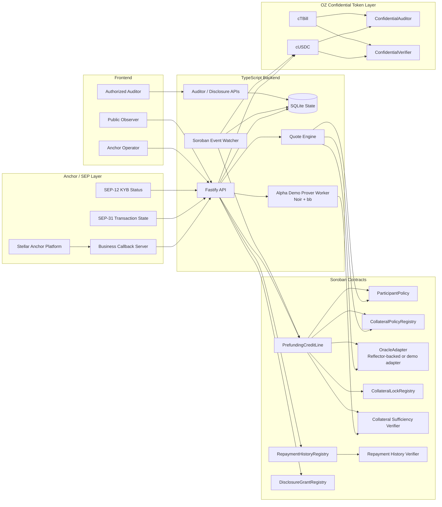

# Nyx Confidential Prefunding

Nyx is a private prefunding credit system for institutional Stellar anchors. It lets an anchor use confidential tokenized collateral to unlock short-term stablecoin liquidity for a real payout need, without revealing reserve size, draw amount, repayment amount, or credit capacity to the public.

The demo target is a two-browser institutional story:

- Left browser: Alpha Remit, the anchor operator requesting private prefunding.
- Right browser: public observer first, then authorized auditor.

The strongest demo moment is simple: the public sees that a compliant credit position exists, but amounts stay hidden; then an authorized auditor loads credentials and decrypts the full draw and repayment trail.

## The Problem

Cross-border anchors often need prefunded liquidity before a payout can complete. The usual choices are bad:

- Keep idle USDC in corridors, which is capital-inefficient.
- Borrow externally and expose treasury stress or reserve size.
- Move collateral publicly and leak strategy to competitors.
- Ask lenders and auditors to trust off-chain PDFs, screenshots, or delayed reconciliation.

For institutional anchors, the hard requirement is not just "can we borrow against collateral?" It is:

- Prove collateral sufficiency without disclosing the collateral amount.
- Release settlement liquidity privately.
- Keep a public audit trail that proves state transitions happened.
- Let an authorized auditor decrypt exact amounts.
- Let a counterparty verify selected facts without seeing the whole book.
- Keep SEP-31 payout state separate from product credit state.

## The Solution

Nyx combines Stellar Anchor Platform, Soroban contracts, OpenZeppelin Confidential Tokens, Noir proofs, and a TypeScript coordination backend.

The flow:

1. Anchor Platform creates or ingests a SEP-31 payout transaction.
2. Alpha KYB status is synced to `ParticipantPolicy` on-chain.
3. The backend quotes private prefunding from real policy/oracle contract state.
4. Alpha generates a collateral sufficiency proof.
5. `PrefundingCreditLine.open` verifies the Noir proof on Soroban.
6. Facility releases cUSDC through an OZ confidential token transfer.
7. Public state shows an active/repaid position, but not amounts.
8. Auditor decrypts live confidential transfer ciphertext references.
9. Repayment closes the credit line and releases the collateral lock.
10. Repayment history proof verifies a scoped private-history statement.
11. Disclosure links expose only approved scoped data with expiry/revocation metadata.

## Architecture



## What Is In This Repo

- `backend/`: Fastify API, Anchor callbacks, quote engine, proof queue, watcher, disclosure/auditor endpoints, SQLite persistence.
- `frontend/`: Next.js demo UI for anchor operator, public observer, auditor, draw, repay, and disclosure flows.
- `oz-confidential/`: Soroban contracts, OZ confidential-token proof-of-life runner, Noir circuits, verifier artifacts, deployment helpers.
- `infra/`: Dockerfiles and Anchor Platform configuration.
- `scripts/`: demo account funding, URL printing, E2E helpers, artifact refresh utilities.
- `data/`: local SQLite state mounted into Docker.
- `deployments/` and `state/`: deployment outputs and generated demo artifacts.

## Core Components

### Anchor And Product State

Nyx keeps SEP status and product status separate.

SEP-31 status:

```txt
pending_sender -> pending_stellar -> completed
```

Nyx product status:

```txt
prefunding_required -> credit_quote_ready -> proof_pending -> proof_verified -> credit_drawn -> repaid -> closed
```

This separation matters. `pending_stellar` means the anchor payout is waiting on Stellar settlement. `credit_drawn` means the Nyx private prefunding leg has released liquidity. They are related, but they are not the same state machine.

### Contracts

- `ParticipantPolicy`: records whether Alpha or another participant is approved to use the credit system.
- `CollateralPolicyRegistry`: stores collateral eligibility, haircut, fee, and tenor policy.
- `OracleAdapter`: exposes oracle price and freshness checks, with Reflector support where configured.
- `CollateralLockRegistry`: prevents collateral reuse and releases locks after repayment.
- `PrefundingCreditLine`: opens credit, records draw, records repayment, emits stable demo events.
- `RepaymentHistoryRegistry`: stores private repayment leaf/root metadata and verifies repayment-history proof claims.
- `DisclosureGrantRegistry`: thin grant registry for scope, expiry, revocation, and auditability. It does not store plaintext.

### Confidential Token Layer

Nyx uses the OpenZeppelin Confidential Token design as the privacy source of truth:

- `cUSDC`: private liquidity leg.
- `cTBill`: private collateral representation.
- `ConfidentialAuditor`: auditor ciphertext source for decryptable transfer data.
- `ConfidentialVerifier`: verifier registry for confidential token operations.

The backend stores encrypted event references and proof artifacts. It should not become the privacy source of truth.

### ZK Proofs

Nyx currently has two proof families:

- Collateral sufficiency: proves private collateral covers requested draw after haircut.
- Repayment history: proves a private repayment-history property, such as at least a threshold number of on-time repayments, without exposing amounts or counterparties.

Demo proving runs through the `prover-worker` service. For production language, call this an Alpha-controlled prover or auditor-controlled tool. Do not claim the backend never sees private witness values unless proving is moved fully into browser/WASM or a separately operated prover.

## Quick Start

### Prerequisites

- Docker Desktop with WSL integration enabled.
- Node.js 20 or 22 for host-side scripts.
- Rust toolchain if running `oz-confidential` locally.
- Stellar CLI available inside the Docker image or local runner path.
- Testnet accounts and secrets in `.env`.

### Environment

Start from the example:

```bash
cp .env.example .env
```

Important values:

```txt
STELLAR_RPC_URL=https://soroban-testnet.stellar.org
STELLAR_HORIZON_URL=https://horizon-testnet.stellar.org
STELLAR_NETWORK_PASSPHRASE=Test SDF Network ; September 2015
ANCHOR_PLATFORM_PUBLIC_URL=http://localhost:8080
ANCHOR_PLATFORM_URL=http://localhost:8080
API_PORT=3001
FRONTEND_PORT=3000
```

For Docker containers, Compose overrides internal Anchor URLs to container hostnames. For host-side runs, use:

```txt
ANCHOR_PLATFORM_URL=http://localhost:8080
ANCHOR_STELLAR_TOML_URL=http://localhost:8080/.well-known/stellar.toml
```

Required operator secrets for the full demo:

```txt
PARTICIPANT_POLICY_OPERATOR_SECRET_KEY=...
CREDIT_EXECUTOR_SECRET_KEY=...
DEMO_ANCHOR_SECRET_KEY=...
```

Required public display/config accounts:

```txt
ALPHA_PUBLIC_KEY=...
FACILITY_PUBLIC_KEY=...
AUDITOR_PUBLIC_KEY=...
CREDIT_EXECUTOR_PUBLIC_KEY=...
```

Required deployed contract IDs:

```txt
PARTICIPANT_POLICY_CONTRACT_ID=...
COLLATERAL_POLICY_CONTRACT_ID=...
ORACLE_ADAPTER_CONTRACT_ID=...
COLLATERAL_LOCK_CONTRACT_ID=...
PREFUNDING_CREDIT_LINE_CONTRACT_ID=...
COLLATERAL_SUFFICIENCY_VERIFIER_CONTRACT_ID=...
COLLATERAL_TOKEN_CONTRACT_ID=...
CONFIDENTIAL_CUSDC_CONTRACT_ID=...
REPAYMENT_HISTORY_CONTRACT_ID=...
REPAYMENT_HISTORY_VERIFIER_CONTRACT_ID=...
DISCLOSURE_GRANT_REGISTRY_CONTRACT_ID=...
```

### Start The Stack

```bash
docker compose up -d --build
```

Check services:

```bash
curl http://localhost:3001/health
curl http://localhost:3001/api/demo/state
curl http://localhost:8080/.well-known/stellar.toml
```

Important URLs:

```txt
Frontend:              http://localhost:3000
API health:            http://localhost:3001/health
Demo state:            http://localhost:3001/api/demo/state
Demo flow state:       http://localhost:3001/api/demo-flow/state
Anchor stellar.toml:   http://localhost:8080/.well-known/stellar.toml
Anchor Platform API:   http://localhost:8085
Business server:       http://localhost:8091/health
```

If `.env` changes after containers are already created, recreate the API containers. `docker compose restart` is not enough because it does not reload Compose env values.

```bash
docker compose up -d --force-recreate --no-deps api prover-worker
```

### Fund Demo Accounts

```bash
npm run fund:demo-accounts
```

Or fund manually with Friendbot for each public key:

```bash
curl "https://friendbot.stellar.org?addr=<PUBLIC_KEY>"
```

### Refresh Confidential Token Artifacts

The cUSDC draw and repayment artifacts are state-bound and should be treated as one-use demo artifacts. If `confidential_transfer_from` fails with OZ `InvalidProof`, regenerate or refresh them.

Run the OZ proof-of-life flow on testnet:

```bash
cd oz-confidential
NYX_RUNNER_NETWORK=testnet cargo run -q -p oz-confidential-runner -- prove-of-life
cd ..
```

Import the generated cUSDC/draw/repay artifacts into `.env`:

```bash
npm run refresh:confidential-artifacts
docker compose up -d --force-recreate --no-deps api prover-worker
```

### Seed The Demo SEP-31 Transaction

On a fresh SQLite DB, seed the opening transaction:

```bash
curl -X POST http://localhost:3001/api/sep31/transactions \
  -H "content-type: application/json" \
  -d '{
    "id": "sep31-alpha-001",
    "account": "<ALPHA_PUBLIC_KEY>",
    "status": "pending_sender",
    "amount_in": "50000",
    "asset_code": "cUSDC",
    "fields": {
      "corridor": "USD-PHP",
      "settlement_window_days": 3
    }
  }'
```

Accept KYB and sync ParticipantPolicy:

```bash
curl -X POST http://localhost:3001/api/anchor/customer/status \
  -H "content-type: application/json" \
  -d '{
    "account": "<ALPHA_PUBLIC_KEY>",
    "status": "ACCEPTED"
  }'
```

### Manual Demo Flow

Run these serially. Do not parallelize; one operator account signs many transactions.

```bash
curl -X POST http://localhost:3001/api/prefunding/quote \
  -H "content-type: application/json" \
  -d '{
    "anchorTransactionId": "sep31-alpha-001",
    "account": "<ALPHA_PUBLIC_KEY>",
    "requestedCreditAmount": "50000",
    "tenorDays": 3
  }'
```

Open credit with the real collateral sufficiency proof:

```bash
curl -X POST http://localhost:3001/api/demo-flow/open \
  -H "content-type: application/json" \
  -d '{}'
```

Draw cUSDC privately:

```bash
curl -X POST http://localhost:3001/api/demo-flow/draw \
  -H "content-type: application/json" \
  -d '{}'
```

Repay and complete settlement:

```bash
curl -X POST http://localhost:3001/api/demo-flow/repay \
  -H "content-type: application/json" \
  -d '{}'
```

Generate and verify repayment history proof:

```bash
curl -X POST http://localhost:3001/api/demo-flow/history-proof \
  -H "content-type: application/json" \
  -d '{}'
```

Inspect final state:

```bash
curl http://localhost:3001/api/demo-flow/state
curl http://localhost:3001/api/demo/state
```

### Auditor Evidence

List live encrypted transfer evidence:

```bash
curl "http://localhost:3001/api/auditor/live-events?positionId=<POSITION_ID>"
```

Decrypt a stored evidence row with demo auditor tooling:

```bash
curl -X POST http://localhost:3001/api/auditor/decrypt \
  -H "content-type: application/json" \
  -d '{"evidenceId":"<EVIDENCE_ID>"}'
```

Important caveat: the current demo decrypt endpoint runs auditor tooling on the backend. Production should move this to auditor-controlled infrastructure or browser/WASM.

## API Surface

Core health/state:

```txt
GET  /health
GET  /api/demo/state
GET  /api/demo-flow/state
```

Anchor and KYB:

```txt
POST /api/sep31/transactions
GET  /api/sep31/transaction?id=...
POST /api/sep31/transaction/:id/pending-stellar
POST /api/sep31/transaction/:id/completed
POST /api/anchor/customer/status
```

Prefunding:

```txt
POST /api/prefunding/quote
POST /api/demo-flow/open
POST /api/demo-flow/draw
POST /api/demo-flow/repay
POST /api/demo-flow/history-proof
```

Proof jobs:

```txt
POST /api/proof/collateral-sufficiency
POST /api/proof/repayment-history
GET  /api/proof/:jobId
```

Watcher and audit:

```txt
POST /api/watcher/sync
GET  /api/auditor/live-events
POST /api/auditor/decrypt
POST /api/disclosure/grants
GET  /api/disclosure/:grantId
POST /api/disclosure/:grantId/revoke
```

## Demo Script Summary

The intended final flow:

1. Start Docker stack.
2. Fund Alpha, Facility, Auditor.
3. Anchor Platform creates or backend seeds payout transaction.
4. Alpha KYB accepted.
5. ParticipantPolicy approval tx confirms.
6. Alpha has cTBill collateral.
7. Facility has cUSDC liquidity.
8. Alpha/Facility confidential-token setup creates spender allowance.
9. Quote is generated from policy/oracle state.
10. Collateral sufficiency proof is generated.
11. `PrefundingCreditLine` verifies the proof.
12. CreditExecutor releases private cUSDC.
13. Public view shows hidden active position.
14. Auditor decrypts live draw evidence.
15. Alpha repays.
16. Lock releases.
17. Repayment history proof verifies.
18. Disclosure link opens scoped data.

## Compliance Architecture

Nyx is designed so compliance can verify participation and outcomes without making the public chain a plaintext financial database.

### Compliance Boundaries

Public chain stores:

```txt
participant approval status
policy references
oracle freshness result
credit position lifecycle
collateral lock key/nullifier
proof verification result
disclosure grant metadata
event hashes and transaction hashes
```

Public chain does not store:

```txt
private collateral amount
private draw amount
private repayment amount
auditor private key
plaintext disclosure bundle
full repayment history
private witness values
```

Backend stores:

```txt
SEP-31 transaction state
SEP-12/KYB status cache
proof jobs
watcher cursor
cached snapshots
encrypted disclosure bundles
encrypted auditor payload references
transaction hashes and event metadata
```

Backend should not be the privacy source of truth. The privacy source of truth is the confidential token event/ciphertext layer plus verifier-checked proofs.

### KYB / Participant Controls

KYB status enters through Anchor callbacks:

- `ACCEPTED` syncs to `ParticipantPolicy` and allows credit flow.
- `REJECTED` blocks credit flow.
- Policy checks happen on-chain before opening credit.

This gives the demo a clear regulated-institution story: customer status is not just UI state; it becomes an on-chain authorization condition.

### Collateral Controls

Collateral controls are split:

- `CollateralPolicyRegistry` defines eligibility, haircut, max tenor, and fee policy.
- `OracleAdapter` checks price and staleness.
- `CollateralLockRegistry` prevents a collateral commitment/nullifier from being reused.
- `PrefundingCreditLine` checks proof, policy, oracle, participant approval, tenor, and lock status before opening.

### Proof Controls

Collateral proof controls:

- Real Noir proof.
- UltraHonk verification on Soroban.
- Public inputs bind oracle price, haircut, tenor, lock key, and nullifier.
- Replay is blocked by `position_nullifier` and lock registry state.

Repayment history proof controls:

- Private leaves and nullifiers.
- Root set in `RepaymentHistoryRegistry`.
- Threshold statement verified without exposing all repayment details.
- Duplicate leaf/nullifier rejected.

### Auditor And Disclosure Controls

Nyx uses:

1. OZ ConfidentialToken as private transfer truth.
2. OZ auditor ciphertexts for decryptable financial evidence.
3. Disclosure SDK/circuit where reusable.
4. Thin `DisclosureGrantRegistry` for permission metadata only.
5. Backend for encrypted bundle and session storage only.
6. Browser or auditor-controlled tooling for decryption and scoped verification.

`DisclosureGrantRegistry` stores:

```txt
grant_id
owner
viewer_hash
position_id
event_id or tx_hash
scope_hash
expires_at_ledger
revoked
created_at_ledger
```

It must not store:

```txt
plaintext amount
private key
decrypted auditor data
full disclosure bundle
```

### Operational Controls

Before a demo:

- Refresh oracle if ledgers advanced past staleness window.
- Confirm Anchor Platform is reachable at `http://localhost:8080/.well-known/stellar.toml`.
- Confirm `/api/demo/state` shows `source: "live"` and no missing accounts.
- Confirm `CONFIDENTIAL_CUSDC_CONTRACT_ID` in the API container matches `.env`.
- Confirm the draw/repay confidential artifacts are fresh.
- Run draw and repayment serially.

## Why Stellar

Nyx is specifically well matched to Stellar because the product sits at the intersection of anchors, compliant payments, tokenized assets, and smart contracts.

### Anchor Standards

Stellar already has the anchor standards Nyx needs:

- SEP-1 for `stellar.toml` discovery.
- SEP-10 for web authentication.
- SEP-12 for KYC/KYB data exchange.
- SEP-31 for cross-border payment transactions.

Nyx does not need to invent the anchor operating model; it extends it with private credit and proof-backed prefunding.

### Payments Plus Contracts

Stellar gives one network for:

- Payment rails and anchor infrastructure.
- Soroban contracts for policy, locks, verifiers, and registries.
- Stablecoin settlement assets.
- Public transaction finality and event observability.

That is important because the demo is not just a lending app. It is a payout liquidity workflow.

### Confidential Token Fit

The OpenZeppelin confidential token work maps directly to Nyx:

- Private transfer amounts.
- Auditor ciphertexts.
- Verifier registry.
- Compliance hooks.
- Confidential wrappers around business assets.

Nyx uses this as the privacy layer instead of inventing a new private token standard.

### Real Oracle And RWA Context

Stellar has active oracle infrastructure such as Reflector and an ecosystem direction that fits tokenized RWAs, stablecoin settlement, and anchor-based financial institutions. Nyx can read policy/oracle state on-chain and keep the quote path tied to deployable infrastructure rather than frontend constants.

### Enterprise Demo Credibility

For the target audience, Stellar gives a credible story:

- Anchor Platform for regulated fiat/crypto businesses.
- SEP standards for interoperability.
- Soroban for programmable risk controls.
- Confidential tokens for privacy.
- Low-friction testnet demos with real transactions and explorer-visible evidence.

## Current Demo Caveats

These are intentional boundaries to keep the demo honest:

- Proving currently runs in the demo prover-worker. Say "Alpha demo prover-worker" unless proving is moved to browser/WASM or Alpha-operated infrastructure.
- Auditor decrypt endpoint currently runs demo auditor tooling on the backend. Production should run this in the browser or on auditor-controlled infrastructure.
- Confidential transfer artifacts are state-bound. If reused, OZ verifier can reject them with `InvalidProof`.
- Oracle may need refresh before demo if the staleness window expires.
- Anchor flow is callback/transaction-state integrated for demo; a fully polished SEP-31 user journey may require more product work.

## Useful Commands

Build TypeScript:

```bash
npm run build
```

Run tests:

```bash
npm test
```

Start API locally:

```bash
node --env-file=.env dist/backend/src/index.js
```

Start frontend locally on Windows without Turbopack:

```bash
cd frontend
npm run dev -- --webpack
```

Print service URLs:

```bash
npm run print:urls
```

Check API container env:

```bash
docker compose exec -T api sh -lc 'env | grep -E "CUSDC|ALPHA|FACILITY|AUDITOR" | sort'
```

## Status

The current backend and contracts support the core demo path:

- SEP-31 state separation.
- KYB to ParticipantPolicy sync.
- Chain-sourced quote.
- Real collateral sufficiency proof.
- Real testnet credit open.
- Real confidential cUSDC draw transfer.
- Real confidential cUSDC repayment transfer.
- Auditor evidence references without public plaintext.
- Thin disclosure grant architecture.
- SQLite persistence for app state and watcher cursor.

Use `/api/demo/state` as the first readiness check before opening the frontend.
