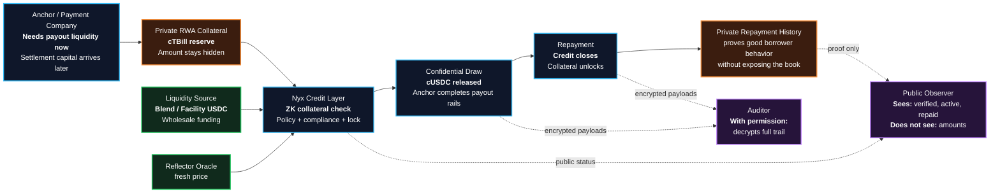

# Nyx Architecture Slide

Use this for a 16:9 pitch slide. Keep the slide title short:

```txt
Private Settlement Credit for Stellar Anchors
```

## Mermaid Diagram



## One-Line Caption

```txt
Nyx lets anchors borrow short-term stablecoin liquidity against private tokenized collateral: the chain verifies safety, the public sees status, and auditors can decrypt only with permission.
```

## Speaker Notes

```txt
Anchors do not always lack money; they lack liquid settlement capital in the right place at the right time.
Nyx lets them use tokenized RWA collateral without exposing reserves or borrowing size.
ZK proves the collateral is enough, Reflector prices it, Blend or a facility supplies liquidity, and Confidential Tokens keep draw and repayment amounts private.
```

