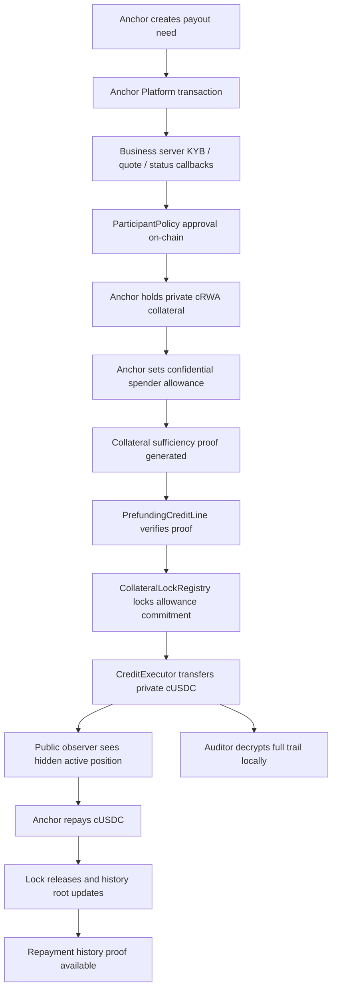

# Master Plan: Confidential RWA-Backed Prefunding Credit for Stellar Anchors

## 1. Project, Pain Point, And Demo Narrative

**Product:** a confidential 1-5 day USDC prefunding credit line for Stellar anchors/payment institutions. An approved anchor privately pledges tokenized RWA reserves, proves with ZK that the collateral covers the requested USDC draw, receives confidential USDC for payout prefunding, repays after corridor settlement, and gives auditors full visibility through auditor keys/selective disclosure.

**Real pain point:** cross-border payment companies keep large balances trapped in prefunded payout accounts because same-day settlement requires liquidity to already be sitting with payout partners. Arf validated that short-term USDC working capital is real demand on Stellar, but that model is underwriting/credit-led. The missing wedge is: anchors that already hold tokenized treasuries, gold, or other RWAs on Stellar should be able to borrow short-term USDC against those reserves without publicly exposing reserve size, corridor strength, or liquidity stress.

**Core pitch line:**  
“Arf proved anchors need short-term USDC working capital. We build the confidential collateral-backed version on Stellar: approved anchors borrow 1-5 day USDC against private RWA reserves, with full auditor visibility and no public exposure of amounts.”

**Why Stellar specifically:**
- Stellar already has anchor/payment infrastructure.
- Stellar has native USDC rails.
- Stellar is moving hard into RWAs and tokenized assets.
- Stellar Confidential Tokens give private balances, hidden amounts, auditor visibility, and compliance hooks.
- Soroban lets us add business logic around collateral, haircuts, repayment, and disclosure.
- The product connects anchor payments, confidential tokens, RWA collateral, and institutional compliance in one native workflow.

**Demo script, 3 minutes:**

| Time | Screen | What Happens | Real System Used |
|---:|---|---|---|
| 0:00-0:20 | Landing / Problem | Show trapped prefunding capital, Arf/Axiym validation, and gap: no confidential RWA-backed prefunding. | Pitch/data only |
| 0:20-0:45 | Anchor Payout + Compliance | Alpha Remit creates a SEP-31-style payout transaction needing 3-day USDC liquidity. KYB accepted; rejected wallet fails. | Anchor Platform + business server + `ParticipantPolicy` |
| 0:45-1:10 | Confidential Collateral Vault | Alpha has private cTBill/cXAUm collateral in OZ Confidential Token wrappers. Public sees asset class/status only, not amount. | OZ Confidential Token |
| 1:10-1:45 | Quote + ZK Sufficiency Proof | Alpha requests a 3-day cUSDC draw. Prover creates `prove_collateral_sufficiency`; contract verifies collateral covers credit after haircut. | Noir + UltraHonk + Soroban verifier |
| 1:45-2:05 | Private USDC Draw | Approved `CreditExecutor` executes confidential cUSDC transfer to Alpha under on-chain authorization. | OZ delegated spender flow + `PrefundingCreditLine` |
| 2:05-2:25 | Public + Auditor View | Public sees active position but hidden amounts. Auditor decrypts full collateral, credit, fee, and repayment trail locally. | Light watcher + auditor key |
| 2:25-2:45 | Repayment + History Proof | Alpha repays cUSDC, lock releases, repayment root updates. Seeded history proves “>=3 on-time repayments” privately. | `RepaymentHistoryRegistry` + second circuit |
| 2:45-3:00 | Disclosure + System Status | Alpha creates scoped disclosure link. System page shows contract IDs, proof verification, Anchor sync, and cached fallback state. | `DisclosureRegistry` + watcher cache |

## 2. What We Reuse Versus What We Build

**Main principle:** do not rebuild Stellar/OZ infrastructure. Use their confidential token, verifier, auditor, and compliance primitives. Build only the business logic around anchor prefunding credit.

| Layer | Reuse | Build |
|---|---|---|
| Anchor/payment flow | Stellar Anchor Platform, SEP-style transaction lifecycle, business-server callbacks | Product-specific prefunding status and liquidity need calculation |
| Confidential token system | OpenZeppelin Confidential Token | Deploy our own cUSDC/cRWA wrappers wired to our auditor/policy |
| Token privacy | OZ private balances, hidden transfer amounts, auditor ciphertexts | Product-specific collateral/credit proofs |
| Compliance | OZ compliance hooks, policy gate, freeze/SAC passthrough | `ParticipantPolicy` synced from Anchor Platform KYB/KYC |
| ZK verifier | Nethermind `rs-soroban-ultrahonk` verifier | Two Noir circuits and product verifier deployments |
| Oracle | Reflector if available; otherwise demo oracle adapter with same interface | Haircut/staleness enforcement in `OracleAdapter` |
| Indexing | Soroban RPC polling | Light watcher for only our own contract IDs |
| Storage | Anchor Platform Postgres for anchor services | SQLite for our product API cache/proof jobs |

**External infrastructure links:**
- Anchor Platform: [architecture docs](https://developers.stellar.org/docs/platforms/anchor-platform/admin-guide/architecture)
- SEP-31 flow: [integration guide](https://developers.stellar.org/docs/platforms/anchor-platform/sep-guide/sep31/integration)
- OZ Confidential Token: [README](https://github.com/OpenZeppelin/stellar-contracts/blob/feat/confidential-verifier-ultrahonk/packages/tokens/src/confidential/README.md)
- OZ Compliance: [COMPLIANCE.md](https://github.com/OpenZeppelin/stellar-contracts/blob/feat/confidential-verifier-ultrahonk/packages/tokens/src/confidential/docs/COMPLIANCE.md)
- Nethermind verifier: [rs-soroban-ultrahonk](https://github.com/NethermindEth/rs-soroban-ultrahonk)
- Noir on Stellar reference: [James Bachini guide](https://jamesbachini.com/noir-on-stellar/)

## 3. Core Architecture



**Important design correction:** `PrefundingCreditLine` should not directly act as the confidential token spender if the OZ token requires private proof generation for `confidential_transfer_from`. A contract cannot generate private witnesses. The hackathon architecture uses an approved off-chain `CreditExecutor` account as the operational spender.

**Role split:**
- `PrefundingCreditLine`: source of truth for quote, approval, proof verification, lock state, repayment, default, and authorization.
- `CreditExecutor`: submits OZ confidential transfer proofs after `PrefundingCreditLine` has authorized the draw.
- `PrefundingComplianceHooks`: blocks unauthorized spender actions and prevents collateral revocation while locked.

## 4. Tokens And Assets

**MVP assets:**

| Token | Wrapper | Purpose |
|---|---|---|
| `tUSDC` | `cUSDC` | Prefunding asset, repayment asset, liquidity facility asset |
| `tTBill` or `tBENJI-mock` | `cTBill` | Main treasury/RWA collateral |
| `tXAUm` | `cXAUm` | Secondary gold collateral with different haircut |

**Why mock assets:** no reusable official cUSDC/cRWA testnet wrappers are assumed. We deploy our own because each confidential wrapper is tied to our auditor registry, verifier registry, compliance policy, and underlying token.

**Asset policy defaults:**

| Asset | Haircut | Max Tenor | Oracle |
|---|---:|---:|---|
| `cUSDC` | 0% | N/A | stable fixed 1.00 |
| `cTBill` | 5-10% | 5 days | Reflector/demo NAV |
| `cXAUm` | 15-20% | 5 days | Reflector/demo price |

## 5. Contracts

**Contracts we deploy:**

| Contract | Responsibility |
|---|---|
| `ParticipantPolicy` | On-chain allowlist, role, jurisdiction, risk tier, expiry, product permissions |
| `CollateralPolicyRegistry` | Eligible collateral assets, haircut bps, max tenor, oracle config, stale price threshold |
| `CollateralLockRegistry` | Actual double-pledge prevention source of truth |
| `PrefundingCreditLine` | Open/draw/repay/default/close lifecycle |
| `RepaymentHistoryRegistry` | Stores accepted repayment-history roots and attestor metadata |
| `DisclosureRegistry` | Stores selective disclosure grants, scopes, expiry, revocation |
| `OracleAdapter` | Normalizes Reflector/demo oracle prices and staleness |
| `CollateralSufficiencyVerifier` | UltraHonk verifier wrapper for circuit 1 |
| `RepaymentHistoryVerifier` | UltraHonk verifier wrapper for circuit 2 |
| `PrefundingComplianceHooks` | Optional custom hook enforcing spender/lock safety |

**OZ contracts/components we reuse:**
- `ConfidentialToken`
- `ConfidentialAuditor`
- `ConfidentialVerifier`
- OZ token circuits: `register`, `withdraw`, `transfer`, `spender_transfer`, `set_spender`, `revoke_spender`
- OZ compliance config: external policy, freeze logic, SAC passthrough where applicable

**Deployment order:**
1. Deploy mock assets: `tUSDC`, `tTBill`, `tXAUm`.
2. Deploy `ParticipantPolicy`.
3. Deploy OZ `ConfidentialAuditor` and register demo auditor Grumpkin key.
4. Deploy OZ `ConfidentialVerifier` and register OZ token circuit verification keys.
5. Deploy `cUSDC`, `cTBill`, `cXAUm`.
6. Deploy `CollateralPolicyRegistry`, `CollateralLockRegistry`, `RepaymentHistoryRegistry`, `DisclosureRegistry`, `OracleAdapter`.
7. Deploy product UltraHonk verifier contracts.
8. Deploy `PrefundingCreditLine`.
9. Register `CreditExecutor` and hook permissions.
10. Write all deployed contract IDs into one shared deployment JSON consumed by backend/frontend.

## 6. Correct Lock And Nullifier Model

**Do not use tenor-based nullifiers as double-pledge protection.** If the nullifier includes `tenor_bucket`, the same collateral could be reused across different tenors.

**Final rule:**
- `CollateralLockRegistry` prevents double-pledging.
- `position_nullifier` prevents replaying the same proof/credit-open action.

**Lock key:**

```text
lock_key = Hash(anchor, collateral_token, spender, allowance_commitment)
```

**Lock lifecycle:**
1. Anchor creates confidential allowance with OZ `set_spender`.
2. Backend reads `allowance_commitment`.
3. `prove_collateral_sufficiency` proves the allowance commitment opens to enough private collateral.
4. `PrefundingCreditLine.open()` checks `CollateralLockRegistry` has no active lock for `lock_key`.
5. `CollateralLockRegistry.lock(lock_key, position_id, expiry_ledger)` is written.
6. Any attempt to reuse the same allowance commitment fails.
7. Repayment closes the credit line.
8. `CollateralLockRegistry.release(lock_key)` unlocks collateral.
9. `revoke_spender` becomes allowed only after release.

## 7. Circuits

### Circuit 1: `prove_collateral_sufficiency`

**Purpose:** prove hidden RWA collateral covers hidden USDC draw after oracle price and haircut.

**Hard requirement:** use the exact same commitment scheme as OZ Confidential Token:
```text
commitment = amount * G + randomness * H
```
The circuit must copy/import the exact Grumpkin Pedersen constants/helpers from OZ circuit code. If the constants differ, the proof is not tied to the real confidential token balance/allowance.

**Public inputs:**
```text
collateral_allowance_commitment
usdc_transfer_commitment
asset_id
oracle_price
haircut_bps
tenor_days
lock_key
position_nullifier
policy_hash
```

**Private inputs:**
```text
collateral_amount
collateral_randomness
credit_amount
credit_randomness
anchor_secret
```

**Constraints:**
```text
collateral_allowance_commitment == commit(collateral_amount, collateral_randomness)

usdc_transfer_commitment == commit(credit_amount, credit_randomness)

collateral_amount * oracle_price * (10000 - haircut_bps)
    >= credit_amount * 10000

1 <= tenor_days <= 5

position_nullifier == Poseidon(anchor_secret, collateral_allowance_commitment, usdc_transfer_commitment)

amounts are range bounded
```

**Contract checks:**
- Anchor approved in `ParticipantPolicy`.
- Anchor role includes `ANCHOR`.
- Collateral asset eligible.
- Oracle price fresh.
- Haircut matches current `CollateralPolicyRegistry`.
- Tenor <= asset max tenor.
- `lock_key` inactive.
- `position_nullifier` unused.
- Proof verifies through `CollateralSufficiencyVerifier`.

**Demo failure path to include:** request credit above what collateral supports. The proof/policy check fails and the frontend shows “insufficient private collateral” without revealing the actual collateral amount.

### Circuit 2: `prove_repayment_history`

**Purpose:** prove private repayment reputation, e.g. “Alpha has at least 3 on-time repayments,” without revealing amounts, dates, lenders, or counterparties.

**Seed plan:** before demo, seed 2-3 historical repayment records into the private Merkle tree. During demo, either prove against the seeded root or add one live repayment that crosses the threshold.

**Public inputs:**
```text
repayment_count_threshold
history_commitment_root
anchor_history_key_hash
```

**Private inputs:**
```text
repayment_records[]
due_dates[]
repayment_dates[]
counterparty_hashes[]
amount_commitments[]
leaf_salts[]
merkle_paths[]
```

**Constraints:**
```text
each selected leaf is included under history_commitment_root

record.status == repaid

repayment_date <= due_date

selected repayment nullifiers are distinct

valid_count >= repayment_count_threshold
```

**Contract checks:**
- Root is current for anchor in `RepaymentHistoryRegistry`.
- Root was submitted by approved attestor/admin.
- Proof verifies through `RepaymentHistoryVerifier`.
- Used history proof nullifier is not replayed if needed.

## 8. Anchor Platform And Compliance Sync

**Important status correction:** do not invent fake SEP-31 statuses like `prefunding_required` or `funds_requested` as Anchor Platform statuses.

**Use real Anchor/SEP transaction status for anchor flow:**
```text
pending_sender
pending_stellar
pending_receiver
pending_external
completed
refunded
expired
error
```

**Use separate product-layer status for our credit workflow:**
```text
prefunding_required
credit_quote_ready
proof_pending
proof_verified
credit_drawn
payout_settling
repaid
defaulted
closed
```

**Combined state example:**

```json
{
  "anchor_transaction": {
    "id": "sep31-alpha-001",
    "sep_status": "pending_stellar",
    "amount": "hidden_or_business_visible",
    "destination_country": "PH"
  },
  "prefunding": {
    "product_status": "prefunding_required",
    "tenor_days": 3,
    "collateral_asset": "cTBill"
  }
}
```

**Compliance sync flow:**
1. Anchor Platform calls our `anchor-business-server` for customer/KYB/KYC-like callbacks.
2. Business server returns one of:
```text
ACCEPTED
NEEDS_INFO
PROCESSING
REJECTED
```
3. If `ACCEPTED`, business server submits:
```text
ParticipantPolicy.approve(
  account,
  role,
  jurisdiction,
  risk_tier,
  kyb_hash,
  expiry_ledger,
  allowed_products
)
```
4. If rejected/expired/frozen, business server submits:
```text
ParticipantPolicy.freeze_or_revoke(account, reason_hash)
```
5. OZ Confidential Tokens call `ParticipantPolicy` through their external compliance policy.
6. `PrefundingCreditLine` also checks `ParticipantPolicy` directly before opening/drawing/repaying.
7. Reconciliation job flags mismatch between Anchor Platform status and on-chain policy state.

**On-chain compliance data only:**
```text
account
role
jurisdiction code
risk tier
KYB hash
expiry ledger
allowed products
freeze/revocation flag
```

**Never store PII on-chain.**

## 9. Backend And Docker

**Docker services:**

| Service | DB | Responsibility |
|---|---|---|
| `anchor-platform-sep-server` | Anchor Postgres | External SEP-facing server |
| `anchor-platform-platform-server` | Anchor Postgres | Anchor transaction state |
| `anchor-platform-db` | PostgreSQL | Required for realistic Anchor Platform setup |
| `anchor-platform-kafka` | Kafka | Keep if using official Anchor Platform quick-run stack |
| `anchor-business-server` | App SQLite | KYB/KYC, rate, quote, transaction callbacks |
| `api` | App SQLite | Product API, proof jobs, dashboard state, disclosure bundles |
| `prover-worker` | Job filesystem/cache | Noir/Barretenberg proof generation |
| `frontend` | None | Product demo UI |
| `watcher` | App SQLite | Light Soroban event/state watcher |

**Postgres versus SQLite decision:**
- Use PostgreSQL for Anchor Platform because that is the safer production-like path.
- Use SQLite for our own backend because proof jobs, watched cursors, cached snapshots, and disclosure metadata are small and demo-local.
- Do not build a full indexer.

**Light watcher watches only:**
```text
cUSDC
cTBill/cBENJI
cXAUm
ParticipantPolicy
PrefundingCreditLine
CollateralLockRegistry
RepaymentHistoryRegistry
DisclosureRegistry
```

**Global demo state endpoint must include fallback cache:**

```json
{
  "live_data_fresh": true,
  "last_watched_ledger": 123456,
  "last_known_good_snapshot": {
    "snapshot_id": "snapshot-001",
    "ledger": 123450,
    "created_at": "2026-07-02T12:00:00Z",
    "source": "watcher-cache"
  }
}
```

If Soroban RPC stalls during demo, frontend shows cached-but-real last known state with a visible freshness label.

## 10. Backend API Surface

| Endpoint | Purpose |
|---|---|
| `GET /health` | Service health |
| `GET /api/demo/state` | Aggregated state for all frontend screens |
| `POST /api/anchor/customer/status` | KYB/KYC mock callback/status update |
| `POST /api/prefunding/quote` | Tenor, haircut, oracle price, fee, public input template |
| `POST /api/proof/collateral-sufficiency` | Create collateral proof job |
| `POST /api/proof/repayment-history` | Create repayment history proof job |
| `GET /api/proof/:jobId` | Poll proof status and artifacts |
| `POST /api/credit/open` | Prepare/submission metadata for opening credit line |
| `POST /api/credit/repay` | Prepare/submission metadata for repayment |
| `POST /api/watcher/sync` | Manual sync trigger |
| `POST /api/disclosure/create` | Create disclosure grant and encrypted disclosure bundle |
| `GET /api/disclosure/:id` | Retrieve scoped disclosure bundle |
| `GET /api/auditor/events/:positionId` | Return encrypted auditor payloads and public metadata, not plaintext |

**Auditor privacy rule:** backend must not return decrypted auditor values. It returns encrypted OZ auditor ciphertexts plus public metadata. The auditor browser/session decrypts locally using the auditor view key.

## 11. Proof Server Flow

**Collateral proof flow:**
1. Frontend requests `/api/prefunding/quote`.
2. API reads collateral policy and oracle price.
3. API returns public-input template.
4. Anchor/prover worker receives private witness:
```text
collateral_amount
collateral_randomness
credit_amount
credit_randomness
anchor_secret
```
5. Worker runs:
```text
nargo execute
bb prove --scheme ultra_honk --oracle_hash keccak
```
6. API stores proof artifact and returns job status.
7. Frontend submits Soroban transaction to `PrefundingCreditLine.open`.
8. Contract verifies proof and locks collateral.

**Repayment history proof flow:**
1. Setup seeds 2-3 historical private repayment records.
2. Repayment updates local private history and root.
3. `RepaymentHistoryRegistry` stores accepted root.
4. Prover generates proof that at least N records are on-time.
5. Contract verifies proof and marks anchor as satisfying repayment-history credential.

**Production note for pitch:** in hackathon, proving runs in Docker. In production, the anchor runs the prover in its own infrastructure so the protocol operator never sees private amounts.

## 12. Frontend Product Spec

**Do not build 10 pages. Build 7 screens.** The frontend should be content/data driven, not cluttered.

### Page 1: Landing / Problem Proof

**Purpose:** explain pain and why this exists.

**Show:**
- “Confidential RWA-backed prefunding for Stellar anchors.”
- Short problem statement: anchors lock liquidity in prefunded accounts.
- Arf/Axiym validation cards.
- Gap card: existing models are unsecured/credit-engine based, not confidential RWA-collateralized.
- Product flow: pledge private RWA, prove sufficiency, draw cUSDC, repay, auditor sees.

**Data source:**
- Static content.
- Optional `/api/demo/state` for live system readiness.

**Optional assets:**
- One architecture PNG or SVG.
- One before/after liquidity diagram.

### Page 2: Anchor Payout + Compliance

**Purpose:** merge payout need and compliance admin into one screen.

**Show:**
- Alpha Remit payout request.
- SEP-style transaction status using real status vocabulary.
- Product-layer prefunding status separately.
- KYB result for Alpha: `ACCEPTED`.
- KYB result for Random Wallet: `REJECTED`.
- On-chain `ParticipantPolicy` sync status.
- Button/action: approve Alpha on-chain.
- Button/action: show rejected wallet cannot open credit.

**Data source:**
- Anchor Platform transaction state.
- `anchor-business-server` KYB status.
- `ParticipantPolicy` watcher state.
- `/api/demo/state`.

**Must not show:**
- Fake SEP statuses like `prefunding_required` inside Anchor Platform status.

### Page 3: Confidential Collateral Vault

**Purpose:** show Alpha has private RWA collateral and public cannot see exact amount.

**Show for Anchor role:**
- cTBill private balance.
- cXAUm private balance.
- cUSDC balance.
- Register/deposit/merge status.
- `set_spender` allowance setup status.
- Collateral policy: haircut, max tenor, oracle freshness.

**Show for Public role:**
- asset class
- eligibility status
- collateral wrapper address
- no exact amount

**Data source:**
- OZ Confidential Token state/events.
- `CollateralPolicyRegistry`.
- `OracleAdapter`.
- `/api/demo/state`.

### Page 4: Quote + ZK Sufficiency Proof

**Purpose:** main product action.

**Show:**
- Select collateral asset: cTBill or cXAUm.
- Select tenor: 1-5 days.
- Request cUSDC amount.
- Haircut and oracle price.
- Proof job status.
- Public inputs preview.
- Submit credit open transaction.
- Failure demo: request too much cUSDC and show proof/policy rejection.

**Data source:**
- `POST /api/prefunding/quote`.
- `POST /api/proof/collateral-sufficiency`.
- `GET /api/proof/:jobId`.
- `PrefundingCreditLine` transaction result.
- `CollateralLockRegistry` lock result.

### Page 5: Public + Auditor Comparison

**Purpose:** centerpiece screen. Same position, two visibility levels.

**Public panel shows:**
- position ID
- anchor pseudonym/name
- collateral asset class
- tenor bucket
- status
- proof verified
- lock active
- amounts hidden
- exact LTV hidden

**Auditor panel shows after local decrypt:**
- collateral amount
- cUSDC draw amount
- haircut
- oracle price
- fee
- repayment amount
- due date
- repayment timestamp
- full transaction trail

**Data source:**
- Public: `/api/demo/state`, watcher, Soroban state.
- Auditor: `GET /api/auditor/events/:positionId` returns encrypted payloads only.
- Auditor browser decrypts locally using auditor key.

**Hard rule:** public panel never calls auditor endpoint.

### Page 6: Repayment + Private History Proof

**Purpose:** show this is a credit system, not only a one-off loan.

**Show:**
- repay cUSDC action
- close position
- collateral lock release
- history root update
- seeded repayment records count
- generate `prove_repayment_history`
- proof result: “Alpha proves >=3 on-time repayments privately”

**Data source:**
- `PrefundingCreditLine`
- `CollateralLockRegistry`
- `RepaymentHistoryRegistry`
- `POST /api/proof/repayment-history`

**Demo setup requirement:**
- Seed at least 2 historical repayments before live demo.
- Live repayment can become the 3rd record, or proof can run against pre-seeded 3-record root.

### Page 7: Facility + Disclosure + System Status

**Purpose:** merge lender/facility, selective disclosure, and technical credibility.

**Show facility section:**
- facility cUSDC capacity
- outstanding private credit count
- utilization with hidden individual amounts where appropriate
- draw authorization status
- repayment/default state

**Show disclosure section:**
- create scoped disclosure for one position
- scope options: collateral only, credit only, full position, repayment proof
- expiry
- revoke button
- disclosure link result

**Show system status:**
- contract IDs
- latest ledger watched
- live RPC status
- last known good snapshot
- Anchor Platform status
- proof verifier status
- OZ token wrapper status

**Data source:**
- `/api/demo/state`
- `DisclosureRegistry`
- watcher cache
- health endpoints

## 13. Implementation Steps

### Step 1: Repository And Toolchain

Create monorepo folders:
```text
contracts/
circuits/
backend/
frontend/
infra/
deployments/
```

Pin dependencies:
```text
OpenZeppelin stellar-contracts feat/confidential-verifier-ultrahonk
Nethermind rs-soroban-ultrahonk
Noir 1.0.0-beta.9
Barretenberg 0.87.0
Rust stable
Stellar CLI
Node LTS
```

### Step 2: Verify OZ Flow Before Product Code

Before writing product contracts, run a minimal confidential token flow:
```text
register
deposit
merge
set_spender
confidential_transfer_from
revoke_spender
```

Acceptance:
- `set_spender` produces an allowance commitment.
- `confidential_transfer_from` works with delegated spender.
- auditor ciphertexts are emitted.
- frozen/rejected participant cannot transact through compliance policy.

### Step 3: Verify Commitment Compatibility

Create a small circuit/test that uses the same OZ commitment constants:
```text
commit(v, r) = v*G + r*H
```

Acceptance:
- same `(value, randomness)` produces the same commitment as OZ token circuit.
- collateral sufficiency circuit uses the same helper, not a different Pedersen setup.

### Step 4: Build Product Contracts

Implement:
```text
ParticipantPolicy
CollateralPolicyRegistry
CollateralLockRegistry
PrefundingCreditLine
RepaymentHistoryRegistry
DisclosureRegistry
OracleAdapter
PrefundingComplianceHooks
```

Acceptance:
- approved anchor can open credit.
- rejected account cannot.
- inactive collateral lock required before open.
- active lock blocks duplicate pledge.
- repayment releases lock.
- revoked/frozen participant cannot continue new flow.

### Step 5: Build Circuits And Verifiers

Implement:
```text
circuits/collateral_sufficiency
circuits/repayment_history
```

Generate:
```text
proof artifacts
public input schemas
verification keys
Soroban verifier deployments
```

Acceptance:
- valid collateral proof verifies.
- insufficient collateral proof fails.
- wrong oracle/haircut public input fails.
- reused nullifier fails.
- valid repayment history proof verifies.
- insufficient on-time records fail.

### Step 6: Build Anchor Platform Integration

Run official Anchor Platform Docker stack with Postgres and Kafka if required by selected quick-run mode.

Implement `anchor-business-server`:
```text
customer/KYB callback
quote/rate callback
transaction status callback
prefunding-needed product flag
ParticipantPolicy sync transaction
reconciliation checker
```

Acceptance:
- Alpha accepted in business server appears approved on-chain.
- rejected wallet remains blocked.
- Anchor transaction uses real SEP status.
- product status is separate.

### Step 7: Build Backend API And Watcher

Implement:
```text
API server
SQLite app store
proof job queue
prover-worker integration
light watcher
last-known-good snapshot cache
disclosure bundle service
auditor encrypted-event endpoint
```

Acceptance:
- `/api/demo/state` can drive all screens.
- proof job lifecycle works.
- watcher survives RPC stall using cached snapshot.
- auditor endpoint returns encrypted payloads, not plaintext.

### Step 8: Build Frontend Screens

Build 7 screens:
```text
Landing / Problem Proof
Anchor Payout + Compliance
Confidential Collateral Vault
Quote + ZK Sufficiency Proof
Public + Auditor Comparison
Repayment + Private History Proof
Facility + Disclosure + System Status
```

Acceptance:
- one role switcher supports Public, Anchor, Compliance Admin, Facility, Auditor.
- live tx hashes visible for approval, proof verify, draw, repay, disclosure.
- public view never exposes hidden amounts.
- auditor values require local decrypt.

### Step 9: Demo Rehearsal

Prepare deterministic demo data:
```text
Alpha Remit accepted
Random Wallet rejected
cTBill collateral available
cXAUm collateral available
facility cUSDC funded
2-3 repayment history leaves seeded
one over-borrow failure case
one RPC fallback snapshot
```

Acceptance:
- full happy path finishes in under 3 minutes.
- one failure path shown cleanly.
- no manual terminal dependency during pitch unless needed as backup.

## 14. Test Plan

**Contract tests:**
- accepted participant can use token/credit flow.
- rejected participant cannot register/transfer/open credit.
- wrong role cannot open credit.
- stale KYB expiry blocks new draw.
- invalid collateral asset fails.
- stale oracle price fails.
- tenor above 5 days fails.
- duplicate lock key fails.
- replayed `position_nullifier` fails.
- repayment releases lock.
- default keeps lock or routes to liquidation/demo default path.
- disclosure expiry/revocation works.

**Circuit tests:**
- valid collateral proof passes.
- insufficient collateral fails.
- wrong randomness fails.
- wrong commitment fails.
- wrong haircut public input fails.
- wrong oracle public input fails.
- valid repayment history proof passes.
- duplicate repayment leaf/nullifier fails.
- late repayment not counted.
- insufficient valid repayment count fails.

**Integration tests:**
- Anchor Platform accepted status syncs to `ParticipantPolicy`.
- Anchor Platform rejected status blocks confidential token usage.
- SEP status and product status remain separate.
- proof worker returns artifacts consumed by frontend.
- watcher updates dashboard from contract events/state.
- cached snapshot appears when live RPC unavailable.
- auditor decrypts locally.
- backend never serves plaintext auditor values.

**Demo acceptance criteria:**
- at least one real UltraHonk proof verified by Soroban.
- OZ Confidential Token used for cUSDC and at least one cRWA.
- one full draw and repayment flow works.
- Anchor Platform runs and drives payment/compliance narrative.
- public/auditor comparison is visible and obvious.
- failure case proves the system is enforcing real policy.

## 15. Assumptions And Defaults

- We deploy our own confidential token wrappers; we do not rely on public predeployed cUSDC/cRWA.
- Real BENJI/XAUm/USDY testnet assets are not required; mock assets are acceptable if wrapped by real OZ Confidential Token contracts.
- Anchor Platform is used for anchor/payment workflow, not for Soroban indexing.
- Anchor Platform uses Postgres; our app uses SQLite.
- Kafka is kept if required by the official Anchor Platform quick-run stack.
- Proving runs in Docker for hackathon; production proving runs inside anchor infrastructure.
- Auditor decryption happens client-side using auditor key; backend does not decrypt for auditor.
- `CollateralLockRegistry` is the double-pledge source of truth.
- `position_nullifier` is replay protection only.
- `CreditExecutor` performs delegated confidential transfer operations under on-chain authorization.
- No PII goes on-chain.
- Confidential Tokens and UltraHonk verifier are developer-preview/testnet only for this project.
- First product wedge is confidential anchor prefunding; repo and collateral mobility can be future expansions.
